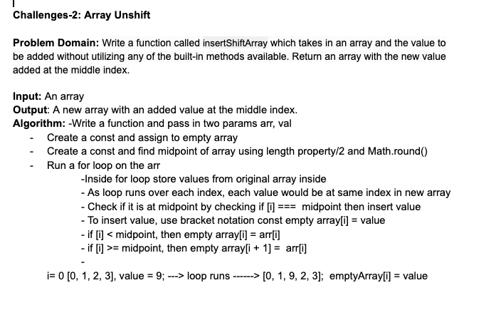

# CHALLENGE 2: Reverse an Array

# Array Shift

## Challenge
- Write a function called `insertShiftArray` which takes in an array and the value to be added without utilizing any of the built-in methods available in JS. Return an array with the new value added at the middle index.

## Approach & Efficiency
Not applicable

## Solution
