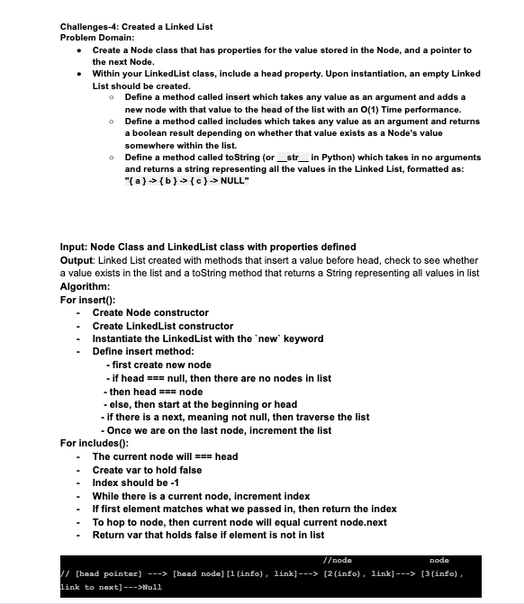
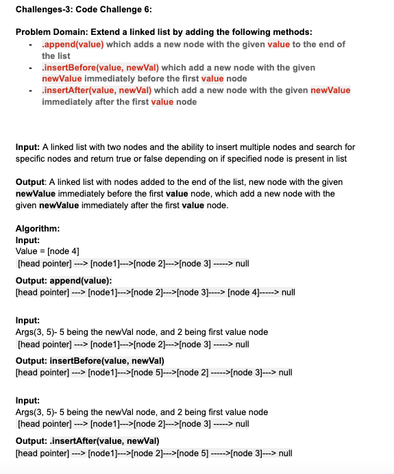
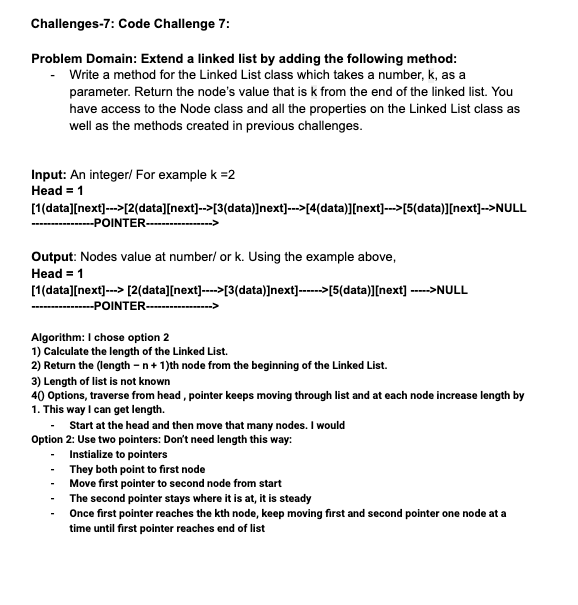
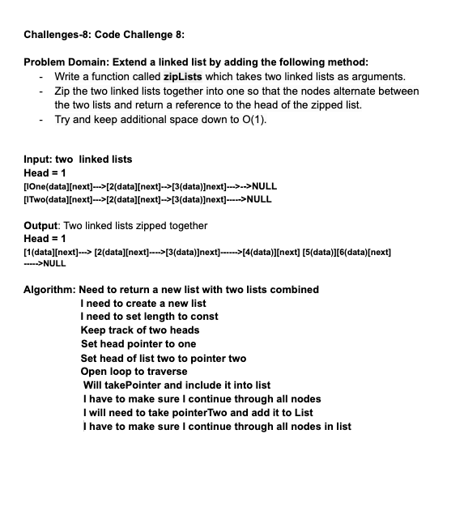

# CHALLENGE 5: Linked List

## Create a Singly Linked List

**Challenge**

- Create a Node class that has properties for the value stored in the Node, and a pointer to the next Node.
- Within your LinkedList class, include a head property. 
- Upon instantiation, an empty Linked List should be created.
- Define a method called `insert` which takes any value as an argument and adds a new node with that value to the head of the list with an O(1) Time performance.
- Define a method called `includes` which takes any value as an argument and returns a boolean result depending on whether that value exists as a Node’s value somewhere within the list.
- Define a method called `toString` (or __str__ in Python) which takes in no arguments and returns a string representing all the values in the Linked List, formatted as:
"{ a } -> { b } -> { c } -> NULL"

## Approach & Efficiency
Not applicable

## Solution

------------------------------------------

## CHALLENGE 6: Extend the Linked List By Adding More Methods

**Write the following methods for the Linked List class:**

- `.append(value)` which adds a new node with the given value to the end of the list
- `.insertBefore(value, newVal)` which add a new node with the given newValue immediately before the first value node
- `.insertAfter(value, newVal`) which add a new node with the given newValue immediately after the first value node

## Approach & Efficiency
Not applicable

## Solution

------------------------------------------

## CHALLENGE 7: Extend the Linked List By Adding More Methods

**Write a method for the Linked List class which takes a number, k, as a parameter:**
- Return the node’s value that is k from the end of the linked list.
- You have access to the Node class and all the properties on the Linked List class as well as the methods created in previous challenges.

## Approach & Efficiency
Not applicable

## Solution

---------------------------------------
CHALLENGE 8: Extend the Linked List

**Write a function called zipLists which takes two linked lists as arguments**
- Zip the two linked lists together into one so that the nodes alternate between the two lists and return a reference to the head of the zipped list.
- Try and keep additional space down to O(1).

## Approach & Efficiency
Not applicable

## Solution

