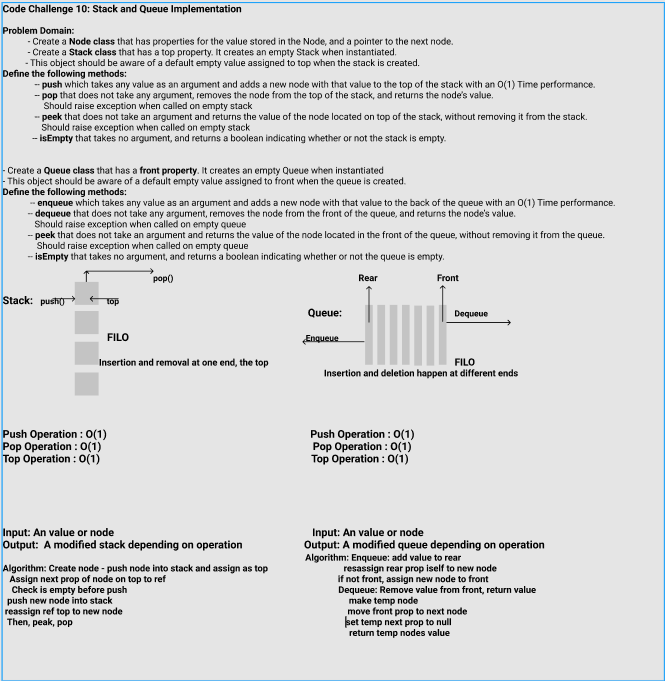

# CHALLENGE 10: Stack and a Queue Implementation

## Challenge
- Create a **Stack class** that has a **top** property. It creates an empty Stack when instantiated.
- This object should be aware of a default empty value assigned to top when the stack is created.
Define the following methods:
    - **push()** which takes any value as an argument and adds a new node with that value to the top of the stack with an O(1) Time performance.
    - **pop()** that does not take any argument, removes the node from the top of the stack, and returns the node’s value. Should raise exception when called on empty stack
    - **peek()** that does not take an argument and returns the value of the node located on top of the stack, without removing it from the stack. Should raise exception when called on empty stack
    - **isEmpty()** that takes no argument, and returns a boolean indicating whether or not the stack is empty.

- Create a **Queue class** that has a **front** property. It creates an empty Queue when instantiated.
- This object should be aware of a default empty value assigned to front when the queue is created.
- Define the following methods: 
    - **enqueue()** which takes any value as an argument and adds a new node with that value to the back of the queue with an O(1) Time performance.
    - **dequeue()** that does not take any argument, removes the node from the front of the queue, and returns the node’s value. Should raise exception when called on empty queue
    - **peek()** that does not take an argument and returns the value of the node located in the front of the queue, without removing it from the queue. Should raise exception when called on empty queue
    - **isEmpty()** that takes no argument, and returns a boolean indicating whether or not the queue is empty.he built-in methods available to your language, return an array with elements in reversed order.

## Solution

