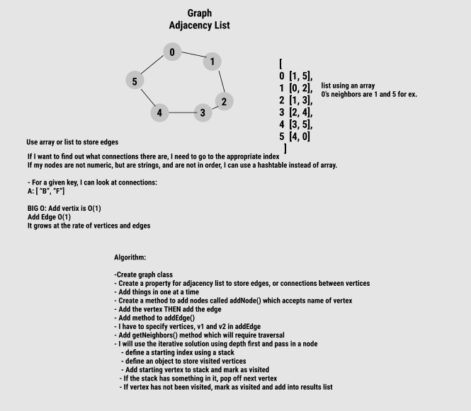
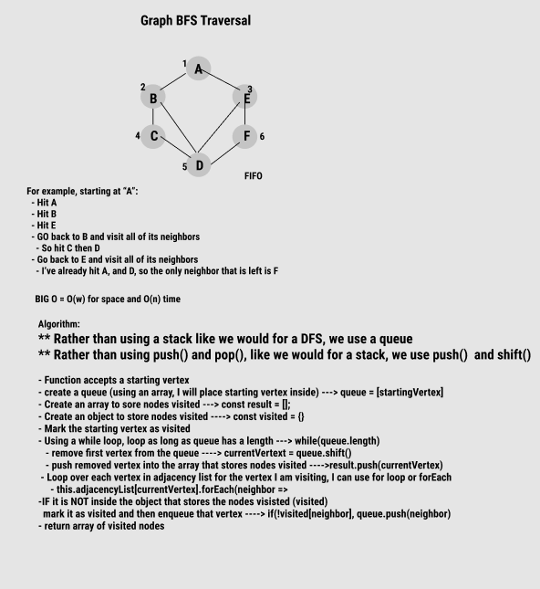
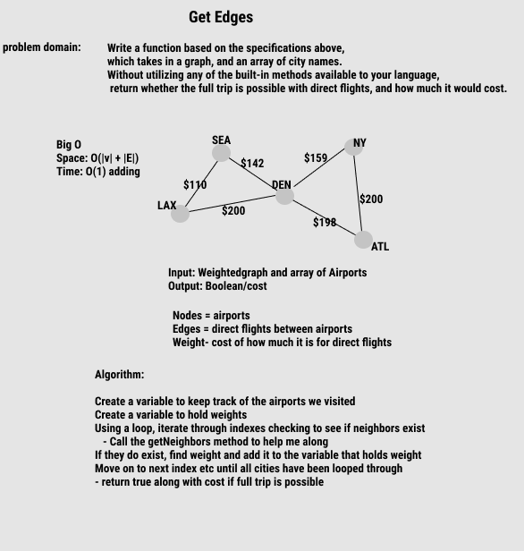
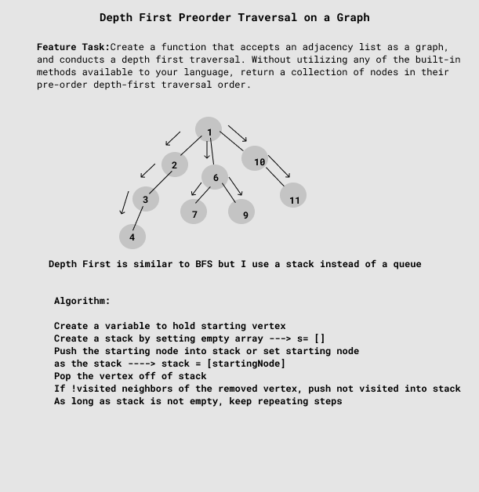

### Challenge 35: Insertion Sort

**Implement your own Graph. The graph should be represented as an adjacency list, and should include the following methods:**

1. `AddNode()`
    - Adds a new node to the graph
    - Takes in the value of that node
    - Returns the added node
2. `AddEdge()`
    - Adds a new edge between two nodes in the graph
    - Include the ability to have a “weight”
    - Takes in the two nodes to be connected by the edge
        - Both nodes should already be in the Graph
3. `GetNodes()`
    - Returns all of the nodes in the graph as a collection (set, list, or similar)
4. `GetNeighbors()`
    - Returns a collection of edges connected to the given node
    - Takes in a given node
    - Include the weight of the connection in the returned collection
5. `Size()`
    - Returns the total number of nodes in the graph

### Challenge 36: Implement a breadth-first traversal on a graph

**Challenge: Extend your graph object with a breadth-first traversal method that accepts a starting node. Without utilizing any of the built-in methods available to your language, return a collection of nodes in the order they were visited. Display the collection.**

### Challenge 37: 

Given a business trip itinerary, and an Alaska Airlines route map, is the trip possible with direct flights? If so, how much will the total trip cost be?

**Feature Tasks**: 

Write a function based on the specifications above, which takes in a graph, and an array of city names. Without utilizing any of the built-in methods available to your language, return whether the full trip is possible with direct flights, and how much it would cost.

### Challenge 38: Depth First Preorder Traversal

**Feature Tasks**

Create a function that accepts an adjacency list as a graph, and conducts a depth first traversal. Without utilizing any of the built-in methods available to your language, return a collection of nodes in their pre-order depth-first traversal order.

